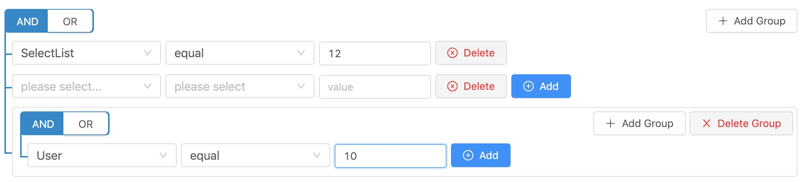

## How to use

```bash
npm i react-sql-query-builder
```

```js
import Querybuilder from 'react-sql-query-builder'
```

```js
  /**
   * Optional fields
   * id is not must
    */
  const fields = [
        { name: 'ID', id : 1},
        { name: 'User', id: 2 }, 
        { name: 'Age', id: 3 }, 
        { name: 'Nation', id: 4 }, 
        { name: 'Datepicker', id: 5 }, 
        { name: 'SelectList', id: 6 }];
  /**
   * Optional operators
   * * id is not must
    */
  const operators = [
        { name: 'equal', id: 1, symbol: '=' },
        { name: 'not equal', id: 2, symbol: '!=' },
        { name: 'is not null', id: 3, symbol: 'is not null' },
        { name: 'is null', id: 4, symbol: 'is null' },
        { name: 'in', id: 5, symbol: 'in' },
        { name: 'not in', id: 6, symbol: 'not in' },
        { name: 'less', id: 7, symbol: 'less' },
        { name: 'less or equal', id: 8, symbol: 'less or equal' },
        { name: 'greater', id: 9, symbol: 'greater' },
        { name: 'greater or equal', id: 10, symbol: 'greater or equal' }
      ];
  <Querybuilder 
    fields={fields} 
    operators={operators} 
    onChange={(data) => {console.log(data)}} 
  />;`
```


